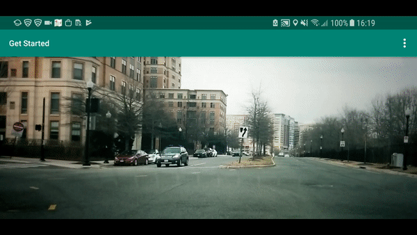

## Vision SDK Get Started example
This project contains basic logic to set up and rum [Vision SDK](https://www.mapbox.com/android-docs/vision/overview/). Also it shows different working modes of [VisionView](https://github.com/mapbox/mapbox-vision-android/blob/dev/MapboxVision/src/main/java/com/mapbox/vision/view/VisionView.kt) class.

